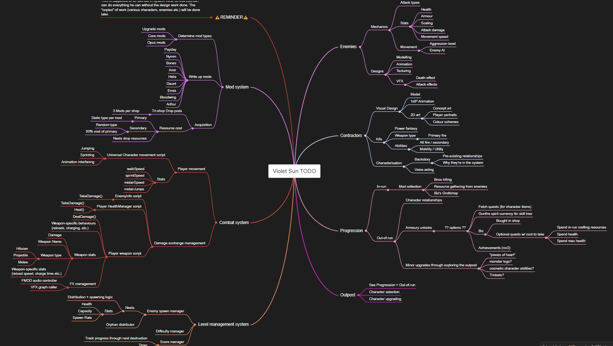
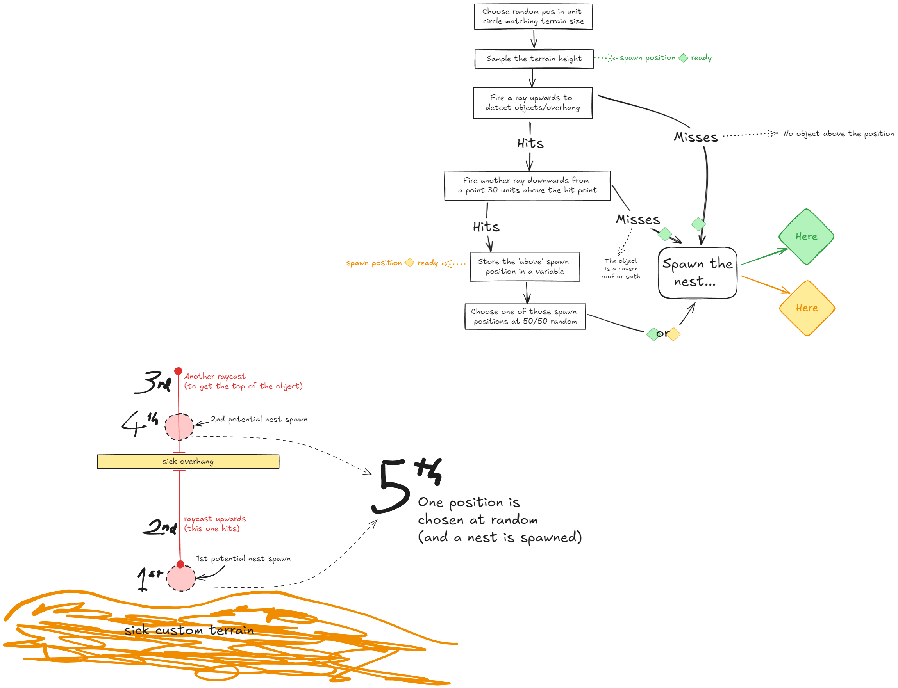
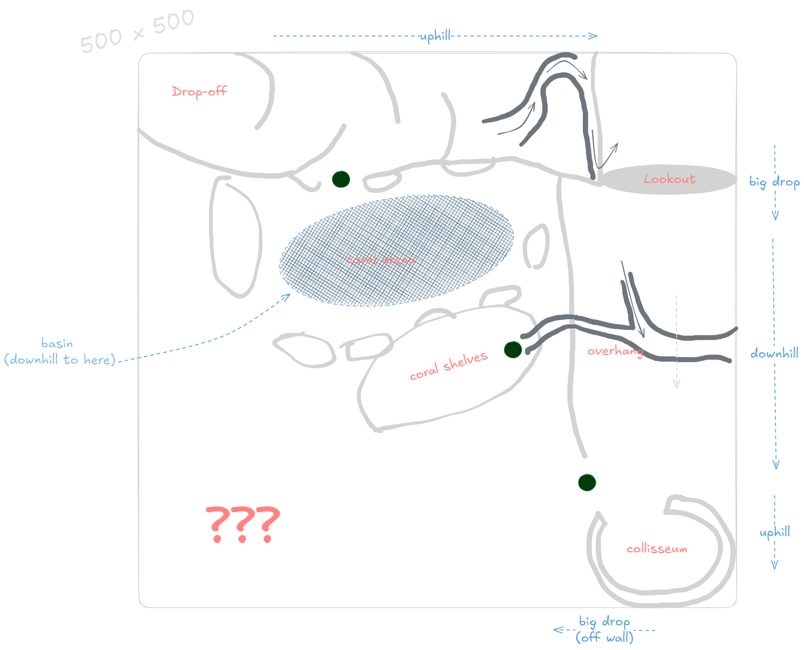
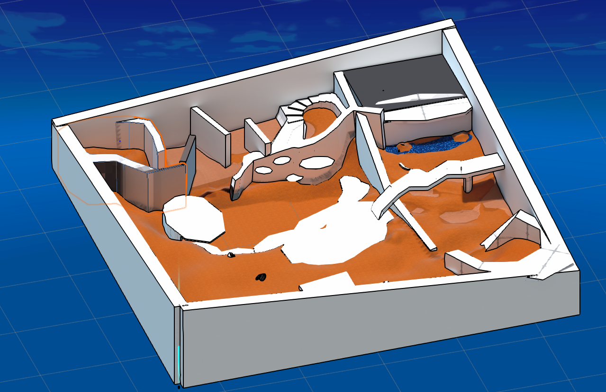
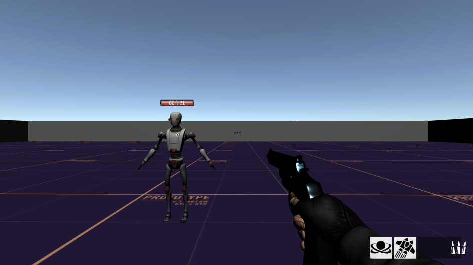

# Hi!

I'm Lachlan, but when I'm making games I'm Quentin Softpaw, the founder and lead dev of Forest Critter Studios. I have a couple friends helping out where I can, but it's mostly a solo project. 

# Violet Sun

Violet Sun is Forest Critter Studios' upcoming debut project. Here's an excerpt from the Game Design Document pitching the concept:

> "Violet Sun is a cooperative, roguelike, character based first-person shooter. It should be fully voice acted, colourful, fluid and highly replayable.
> Players take the role of *Contractors*, a set of diverse playable characters employed by [[The Megacorp]] to clear out a series of planets of dangerous pests and monsters. 
> Players collect upgrades to their character's kit throughout a run, and persistent upgrades give a small boost of power to Contractors between runs. "

It's a work-in-progress, and I've laid out some of that progress here! The fastest way to get a grips on what the game's up to is to watch these two gameplay update videos I made to share with friends! They're only short.





## Characters & more media
I'm doing all of the programming, 3D modelling, rigging, animations, sound design, shading/rendering, game design, art direction, visual effects, optimisation and level design. Here are visuals!

  
  
  

*Payday the gunslinger, Ensis the mercenary swordswoman (first take), Ensis - updated!*
*That's a custom toon shader! It's really performant.*

Here's a more recent gameplay gif showcasing the newer UI direction, with dynamic resource pickups and feedback on cooldown completion. The animations for Nim, the character being played, are far from finished!

Here's a showcase of the GPU-instanced grass I made, entirely from shaders with no animations. It's not usually this dense, but this is still running at ~70 fps.

These are the DropShops (courtesy of Biz the merchant cat) littered around the map. They have powerful Mods for sale that enhance player abilities.

## The process
I've been documenting the process in a casual way in my private discord. I share development updates, next-step mindmaps, and some deeper dives into implemenations I find interesting. The game is a huge undertaking and the documentation helps me take stock and stay motivated!

Here's a screenshot from a much earlier build - how far we've come!

## Bonus
If you're *really* interested, here's the whole game design document that got me this far.

<iframe src="01 - Game Design Document.pdf" width="100%" height="600px">
  This browser does not support PDFs. Please download the PDF to view it:
  <a href="01 - Game Design Document.pdf">Download PDF</a>
</iframe>
